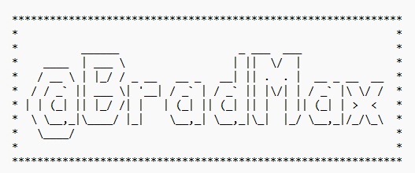
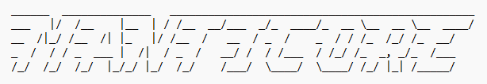

# rust-infostealer-parser

Detects and parses infostealer.

## Installation

```bash

```

## Supports

- Group Meta
  - META

    
  
  - REDLINE
  
    
  
  - BRADMAX
  
    
  
  - MANTICORE
  
    

- Group Unknown
  - Stealers that we cannot identify.

## References

- https://github.com/anhnmt/go-infostealer-parser
- https://github.com/milxss/universal_stealer_log_parser
- https://github.com/lexfo/stealer-parser